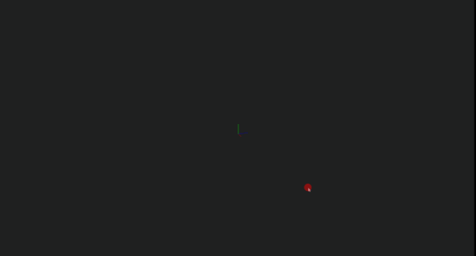
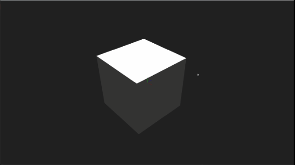
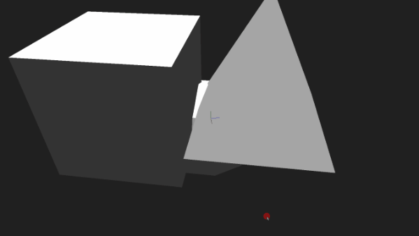

# 3D Editor

This is a software rasterizer that renders simple .obj models.
As of now, it only accepts five basic shapes (cube, cylinder, pyramid and cone or a low-poly sphere), though their contents can be overwritten to accept other models. SFML 3.0.2 has been used to render pixels on screen.

## Opening the editor
In the `editor` directory you will find all the header and source files necessary to compile this project.

Besides those there is a directory called `SFML-3.0.2`, in which reside functionalities for pixel rendering on a window. **It is important to keep it as is.**

The entry point for this project is `editor.cpp`

## Controls
Upon opening the editor you will be met with a terminal with instructions. It specifies how to move in 3D space, select objects, and how to transform them.

Right below there is a list of controls in a more readable format.

### Movement & Selection
- **WASD** - move around
- **Right Click + Mouse** - look around with the camera
- **Click** an object - select it
- **Z** - delete the currently selected mesh

### Spawning Primitives
Press a number key (1-5) to spawn a primitive mesh in front of you:

| Key | Primitive |
|-----|-----------|
| 1   | Cube      |
| 2   | Sphere    |
| 3   | Pyramid   |
| 4   | Cylinder  |
| 5   | Cone      |

### Changing Color
Press a number key (6-0) to change the color of the selected mesh:

| Key | Color  |
|-----|--------|
| 6   | White  |
| 7   | Red    |
| 8   | Blue   |
| 9   | Green  |
| 0   | Yellow |

### Edit Mode
- **Space** - toggle Edit Mode
- While in Edit Mode, the camera is locked but you can move/edit with **WASD**
- The window is surrounded by a green border while in Edit Mode
- **Arrow Keys** - cycle through edit modes (`<-` previous | `->` next)

| Mode | Name | Description |
|------|------|--------------|
| 1 | Translation | Move selected object along world axes (X, Y, Z) |
| 2 | Rotation | Rotate selected object along world axes (X, Y, Z) |
| 3 | Scaling | Scale selected object along world axes (X, Y, Z) |
| 4 | Vertex Movement | Move selected vertex relative to camera direction |

### Other Toggles
- **X** - toggle axes drawn at the center of the screen
- **C** - toggle wireframe view (triangle edges)
- **V** - toggle depth map (whiter pixels = closer to camera)

## Known Limitations
Due to project constraints I was not allowed to use OOP. As a solution I had to resort to functions that accepted references of `struct's` as a parameter. If I was allowed to use OOP I would have used Design Patterns in order to make the codebase more flexible, scalable and easier to work with (for instance a Singleton for the 3D space and a Factory for shapes/meshes).

Another known limit is the lack of an UI. It may not be intuitive to manipulate shapes using the keyboard only. If OOP was allowed, a Builder, Composite and Observer would have been useful here in order to maintain a big number of UI properties, establish an organised hierarchy and handle events (such as button clicks).